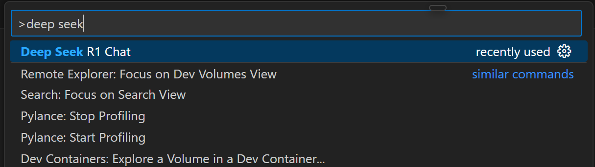
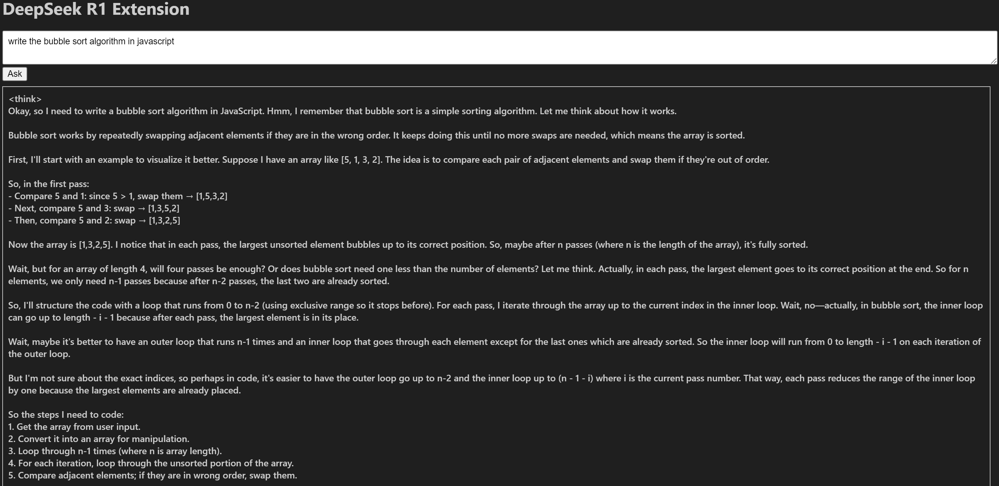
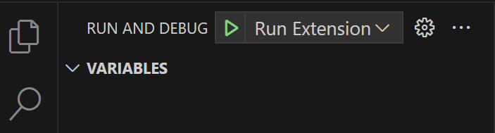

# deepseek-r1-ext

This VS Code extension provides a chat interface for the [DeepSeek-R1](https://ollama.com/library/deepseek-r1) model.
Currently it's using the deepseek-r1:7b distilled version so it can be run on local hardware.

## Features

- Chat with the DeepSeek R1 model directly within VS Code.
- Stream responses from the model in real-time.
- Simple and intuitive webview interface.

## Requirements

- VS Code version 1.96.0 or higher.
- [Ollama](https://ollama.com/download/windows) to interact with the DeepSeek R1 model.

## Installation

- Download and install [Ollama](https://ollama.com/download/windows)
- Install deepseek-r1-ext-0.0.1.vsix from the root folder

To install a .vsix file in VS Code:

Go to the Extensions view.
Click Views and More Actions...
Select Install from VSIX...
or

in your terminal, run the following command:

```
    code --install-extension deepseek-r1-ext-0.0.1.vsix
```

## Usage

- After the extension is installed you can start it by typing this command:



- Ask anything



## Contributing

If you want to contribute to this extension or just want to use a different version of the deepseek-r1 model:

- Install Ollama api
```
    npm install ollama
```
- Run and Debug extension



- Package extension

In VS Code terminal run:

```
    vsce package
```

## Extension Settings

This extension does not add any VS Code settings through the `contributes.configuration` extension point.

## Known Issues

- None at the moment.

## Release Notes

### 0.0.1

- Initial release of DeepSeek R1 extension.

---

**Enjoy!**